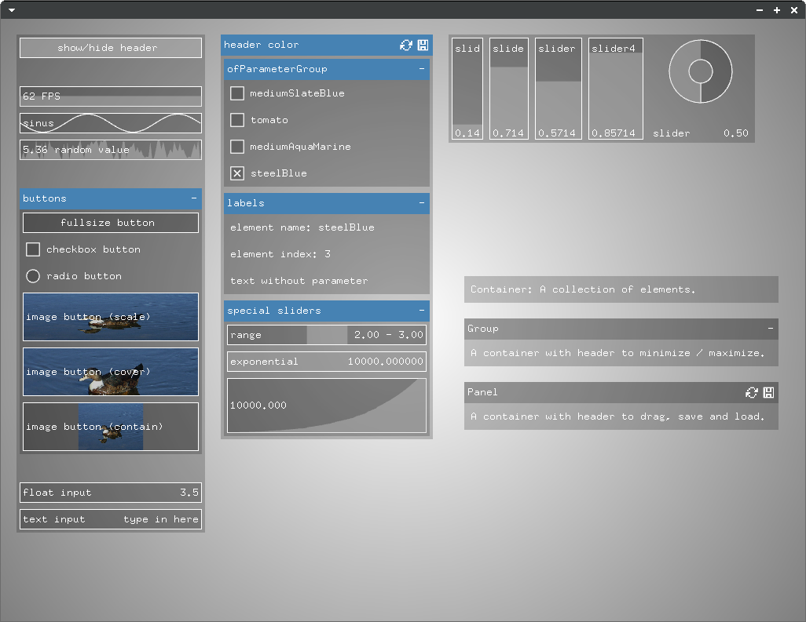

# ofxGuiExtended

[](https://travis-ci.org/frauzufall/ofxGuiExtended)

[](https://ci.appveyor.com/project/frauzufall/ofxguiextended)

This is a gui addon displaying `ofParameter` based data with a focus on simplicity and extensibility. It can be configured using JSON.




## System requirements
Since ofJson just recently got added to openFrameworks, you have to use the current master branch in order for it to work. Please report an issue if ofxGuiExtended is not compatible with the latest openFrameworks version.

This addon is tested on Ubuntu 16.04 64bit. Please tell me if it runs on other systems or if you have issues.

## Versions and dependencies
This addon was first built as an extension for the OF core ofxGui addon. You can download this version [here](https://github.com/frauzufall/ofxGuiExtended/releases/tag/v0.1).

This is the standalone ofxGuiExtended version build from ofxGui. It also contains a minimized version of [ofxDOM](https://github.com/bakercp/ofxDOM). It does not depend on other addons.

## Extensions
This addon is built with the best intentions to be as extensible as possible. There are addons working with ofxGuiExtended:
 - [ofxSortableList](https://github.com/frauzufall/ofxSortableList)
 - [ofxMasterSlaveControl](https://github.com/frauzufall/ofxMasterSlaveControl)
 - [ofx2DMapping](https://github.com/frauzufall/ofx2DMapping) *compatible version is not online yet*


Please tell me if you wrote something compatible, I will add it to the list. Check out the bottom of this page for contribution and implementation notes.

## Usage

### Basics
Just initialize some parameters and pass them on to the addon. It will create a panel showing the parameters. Have a look at [this example](example) to see it in action.
```c++
//ofApp.h

#include "ofxGuiExtended"

//..
ofxGui gui;

ofParameter<bool> moving;
ofParameter<float> speed;
ofParameter<float> rotation;
//..
```
```c++
//ofApp.cpp

void setup(){

  // initialize the parameters you want to work with
  moving.set("moving", true);
  speed.set("speed", 0.5, 0, 1);
  rotation.set("rotation", 0, 0, 360);

  // add them to the gui
  gui.add(moving, speed, rotation);
}
```

### Using containers
A container is just a collection of other elements, a group derives from it and has a header to minimize and maximize itself and a panel has a header to move it around and save and load element states.


In the last example, the panel got created automatically, but you can also create containers yourself.
```c++
ofxGuiPanel* panel = gui.addPanel();
panel->add(..);
```

In the same way you can add other containers to existing containers:
```c++
ofxGuiGroup* group = panel->addGroup();
group->add(..);
```

Some parameters automatically create groups if you add them to the gui:

```c++
ofParameter<ofPoint> position;
ofParameter<ofColor> color;

gui.add(position, color);
```

### Adding controls
Controls get automatically created whenever you add a parameter to the GUI.
```c++
panel->add(moving);    // creates a toggle
panel->add(speed);     // creates a slider
panel->add(rotation);  // creates a slider
```
You can also add a specific control (this is very useful if you implement your own control classes):
```c++
panel->add<ofxGuiLabel>("labeltext");
panel->add<yourControlElementClass>(/* contructor parameters of control element class */);
```

### Setting attributes
There are attributes that you can set for each element. You will find these attributes in the description of the classes beneath the examples on this page.
#### Styling individual items via ofJson
When adding parameters or creating containers, you can append attributes with `ofJson`.
```c++
ofJson panelConfig = {{"background-color", "#ff0000"}, {"padding", 10}};
ofJson itemConfig = {{"fill-color", "rgba(0,255,255,0.5)"}};

ofxGuiPanel* panel = gui.addPanel("panel title", panelConfig);
panel->add(moving, itemConfig);
panel->add(speed, itemConfig);
panel->add(rotation, itemConfig);
```

#### Styling individual items via JSON file
The goal is to set attributes in an external file to set style and layout without recompiling. This is not yet implemented but most of the work is done, stay tuned.

#### Styling items by type via Theme
In a theme you can define attributes for the different element class types. Have a look at [this example](exampleThemes). Also read the class descriptions in the next chapters of this page for the class type names and the attributes that you can set for each class.

This is how you load a theme:
```c++
panel = gui.addPanel();
panel->loadTheme("theme_light.json");
```

A theme file could look like this:
```json
//theme_light.json
{
	"light": {
		"base": {
			"background-color": "rgba(255,255,255,0.4)",
			"fill-color": "rgba(255,255,255,1)",
			"border-width": 0,
			"padding": 0,
			"border-color": "rgb(0,0,0)",
			"margin": 3,
			"text-color": "#000000",
			"text-padding": 3
		},

		"group": {
			"background-color": "rgba(155,155,155,0.6)",
			"border-color": "#ffffff",
			"padding": 1,
			"margin-left": 20,
			"border-width": 1
		},

		"group-header": {
			"background-color": "#2da1e3",
			"text-color": "#ffffff"
		}
	}
}
```

### Using layouts
The default layout lets you align elements in containers horizontally and vertically. The layout can be changed. ofxDOMFlexBoxLayout was implemented for more complex layout scenarios. If you want to use it, you have to set it up before adding elements to the GUI:
```c++
gui.setupFlexBoxLayout();
```
Have a look at the layout attribute descriptions later in this file for details and check out [this flexbox layout example](exampleLayout).

If you want to implement your own layout class, you can use it by adding it to your GUI like this (assuming `ofxDOMLayoutCustom` is your layout class):
```c++
gui.setup<ofxDOMLayoutCustom>();
```

## Controls

### `ofxGuiElement`
  - Derived from `DOM::Element`.
  - Base class of all other gui elements.
  - class type name for JSON theme: `base`
  <table>
	<col width="35%" />
	<col width="15%" />
	<col width="25%" />
	<col width="25%" />
		<tr>
			<td><strong>Attribute</strong></td>
			<td><strong>Value</strong></td>
			<td><strong>Example</strong></td>
			<td><strong>Description</strong></td>
		</tr>
		<tr>
			<td><code>show-name</code></td>
			<td><code>bool</code></td>
			<td><code>true</code></td>
			<td>Display or hide the name of the element.</td>
		</tr>
		<tr>
			<td><code>background-color</code><br><code>border-color</code><br><code>fill-color</code><br><code>text-color</code><br><code>header-background-color</code></td>
			<td><code>string</code></td>
			<td><code>"#ff0000"</code><br><code>"rgb(255,0,0)"</code><br><code>"rgba(255,0,0,0.5)"</code><br><code>"transparent"</code></td>
			<td>Colors of the element.</td>
		</tr>
		<tr>
			<td><code>border-width</code></td>
			<td><code>float</code></td>
			<td><code>1</code></td>
			<td>Width of the border.</td>
		</tr>
		<tr>
			<td><code>border-radius</code></td>
			<td><code>float</code></td>
			<td><code>3</code></td>
			<td>Radius of the border (not implemented for all controls yet).</td>
		</tr>
		<tr>
			<td><code>text-align</code></td>
			<td><code>string</code></td>
			<td><code>left</code><br><code>right</code><br><code>center</code></td>
			<td>Sets the text alignment. *Currently only affecting fullsize toggles.*</td>
		</tr>
		<tr>
			<td><code>font-family</code></td>
			<td><code>string</code></td>
			<td><code>"fonts/UbuntuMono-B.ttf"</code></td>
			<td>Sets the font family and changes the font rendering from bitmap font to TTF. Font path is relative to <code>bin/data</code>.</td>
		</tr>
		<tr>
			<td><code>font-size</code></td>
			<td><code>float</code></td>
			<td><code>10</code> (default)</td>
			<td>Sets the font size. Only works if you set a font family, the default bitmap font has a fixed size. The elements can't currently update their size according to the font size so if you set it high you have to adjust the element size yourself in order to prevent overlapping.</td>
		</tr>
		<tr>
			<td><code>margin</code></td>
			<td><code>float</code><br><code>string</code></td>
			<td><code>10</code><br><code>"10 20"</code><br><code>"10 20 30"</code><br><code>"10 20 30 40"</code></td>
			<td>Set the margin of the element. Analog to CSS margin.</td>
		</tr>
		<tr>
			<td><code>margin-top</code><br><code>margin-right</code><br><code>margin-bottom</code><br><code>margin-left</code></td>
			<td><code>float</code></td>
			<td><code>10</code></td>
			<td>Set the margin for the specified side of the element.</td>
		</tr>
		<tr>
			<td><code>padding</code></td>
			<td><code>float`<br>`string</code></td>
			<td><code>10</code><br><code>"10 20"</code><br><code>"10 20 30"</code><br><code>"10 20 30 40"</code></td>
			<td>Set the padding of the element. Analog to CSS padding. Padding currently only has an effect on containers, not on controls.</td>
		</tr>
		<tr>
			<td><code>padding-top</code><br><code>padding-right</code><br><code>padding-bottom</code><br><code>padding-left</code></td>
			<td><code>float</code></td>
			<td><code>10</code></td>
			<td>Set the padding for the specified side of the element.</td>
		</tr>
		<tr>
			<td><code>background-image</code></td>
			<td><code>string</code></td>
			<td><code>images/ente.jpg</code></td>
			<td>Set the background image path of the element, relative to the bin directory of the application.</td>
		</tr>
		<tr>
			<td><code>background-size</code></td>
			<td><code>string</code></td>
			<td><code>cover</code> (default)<br><code>contain</code><br><code>scale</code></td>
			<td>Set how the background image is sized - <code>contain</code> makes the whole image fit inside the element by keeping it's proportions, <code>cover</code> makes the image cover the element by keeping it's proportions, <code>scale</code> scales the image to the same size as the element.</td>
		</tr>
</table>


### `ofxGuiToggle`
  - Derived from `ofxGuiElement`.
  - Default control type for `ofParameter<bool>`.
  - class type name for JSON theme: `toggle`
  <table>
	<col width="30%" />
	<col width="15%" />
	<col width="30%" />
	<col width="25%" />
	<tr>
		<td><strong>Attribute</strong></td>
		<td><strong>Value</strong></td>
		<td><strong>Example</strong></td>
		<td><strong>Description</strong></td>
	</tr>
	<tr>
		<td><code>type</code></td>
		<td><code>string</code></td>
		<td><code>"checkbox"</code> (default)<br><code>"radio"</code><br><code>"fullsize"</code></td>
		<td> Visual type of toggle.</td>
	</tr>
  </table>

### `ofxGuiButton`
  - Derived from `ofxGuiToggle`.
  - Default control type for `ofParameter<void>`.
  - class type name for JSON theme: `button`

### `ofxGuiSlider`
  - Derived from `ofxGuiElement`.
  - This is a template class, use `ofxGuiFloatSlider` or `ofxGuiIntSlider`.
  - Default control types for `ofParameter<float>` and `ofParameter<int>`.
  <table>
	<col width="30%" />
	<col width="15%" />
	<col width="30%" />
	<col width="25%" />
	<tr>
		<td><strong>Attribute</strong></td>
		<td><strong>Value</strong></td>
		<td><strong>Example</strong></td>
		<td><strong>Description</strong></td>
	</tr>
	<tr>
		<td><code>type</code></td>
		<td><code>string</code></td>
		<td><code>"straight"</code> (default)<br><code>"circular"</code></td>
		<td> Visual type of slider. The straight type will appear as a horizontal or vertical slider depending on the aspect ration of its size.</td>
	</tr>
	<tr>
		<td><code>precision</code></td>
		<td><code>int</code></td>
		<td><code>6</code> (default)</td>
		<td>Sets the displayed precision of a <code>float</code> value. The value of the parameter won't be changed.</td>
	</tr>
	<tr>
		<td><code>update-on-release-only</code></td>
		<td><code>bool</code></td>
		<td><code>false</code> (default)</td>
		<td>If true, the slider will trigger on release only.</td>
	</tr>
  </table>

### `ofxGuiLabel`
  - Derived from `ofxGuiElement`.
  - Displays a text or a numerical value as a label.
  - class type name for JSON theme: `label`

### `ofxGuiGraphics`
  - Derived from `ofxGuiElement`.
  - Displays any `ofBaseDraws` reference.
  - class type name for JSON theme: `graphics`

### `ofxGuiZoomableGraphics`
  - Derived from `ofxGuiGraphics`.
  - `ofBaseDraws` reference can be zoomed with scroll wheel and dragged with mouse button.

### `ofxGuiValuePlotter`
  - Derived from `ofxGuiElement`.
  - class type name for JSON theme: `value-plotter`
  - //TODO

### `ofxGuiFpsPlotter`
  - Derived from `ofxGuiValuePlotter`.
  - //TODO

### `ofxGuiFunctionPlotter`
  - Derived from `ofxGuiElement`.
  - class type name for JSON theme: `function-plotter`
  - //TODO


## Containers

### `ofxGuiContainer`
- derived from `ofxGuiElement`.
- Contains other elements according to the current layout
- class type name for JSON theme: `container`

### `ofxGuiGroup`
- derived from `ofxGuiContainer`.
- Groups other elements according to the current layout with a header to minimize or maximize the group
- class type name for JSON theme: `group`
- class type name of group header for JSON theme: `group-header`
<table>
  <col width="30%" />
  <col width="15%" />
  <col width="30%" />
  <col width="25%" />
  <tr>
	  <td><strong>Attribute</strong></td>
	  <td><strong>Value</strong></td>
	  <td><strong>Example</strong></td>
	  <td><strong>Description</strong></td>
  </tr>
  <tr>
	  <td><code>show-header</code></td>
	  <td><code>bool</code></td>
	  <td><code>true</code> (default)</td>
	  <td>Show or hide the header of the group.</td>
  </tr>
</table>

### `ofxGuiPanel`
  - derived from `ofxGuiGroup`.
  - Header can be used to drag group (only if panel is in absolute position mode).
  - class type name for JSON theme: `panel`
- class type name of group header for JSON theme: `panel-header`

### `ofxGuiTabs`
  - derived from `ofxGuiGroup`.
  - Add groups to this container and they will be displayed as tabs.
  - class type name for JSON theme: `tabs`
  - //TODO


## Layouts

### `ofxDOMBoxLayout`
- Derived from `DOM::Layout`.
- Simple layout that lets you align elements in a container horizontally or vertically. Vertically aligned items will always use the full width of the container, horizontally aligned items will always use the full height of the container.
  <table>
	<col width="30%" />
	<col width="15%" />
	<col width="30%" />
	<col width="25%" />
	<tr>
		<td><strong>Attribute</strong></td>
		<td><strong>Value</strong></td>
		<td><strong>Example</strong></td>
		<td><strong>Description</strong></td>
	</tr>
	<tr>
		<td><code>width</code><br><code>height</code></td>
		<td><code>float</code><br><code>string</code></td>
		<td><code>800</code><br><code>"70%"</code></td>
		<td>Size of the element.</td>
	</tr>
	<tr>
		<td><code>direction</code></td>
		<td><code>string</code></td>
		<td><code>"vertical"</code> (default)<br><code>"horizontal"</code></td>
		<td>The direction child elements get aligned.</td>
	</tr>
</table>


### `ofxDOMFlexBoxLayout`
- Derived from `ofxDOMBoxLayout`.
- Implements parts of the [CSS FlexBox Layout](https://www.w3.org/TR/css-flexbox).
- There are multiple guides online that describe the layout and its options [[1]](https://scotch.io/tutorials/a-visual-guide-to-css3-flexbox-properties), [[2]](https://css-tricks.com/snippets/css/a-guide-to-flexbox/).
<table>
  <col width="30%" />
  <col width="15%" />
  <col width="30%" />
  <col width="25%" />
  <tr>
	  <td><strong>Attribute</strong></td>
	  <td><strong>Value</strong></td>
	  <td><strong>Example</strong></td>
	  <td><strong>Description</strong></td>
  </tr>
  <tr>
	  <td><code>width</code><br><code>height</code></td>
	  <td><code>float</code><br><code>string</code></td>
	  <td><code>800</code><br><code>"70%"</code></td>
	  <td>Size of the element.</td>
  </tr>
  <tr>
	  <td><code>flex</code></td>
	  <td><code>string</code><br><code>float</code></td>
	  <td><code>"none"</code> (default)<br><code>"auto"</code><br><code>3</code></td>
	  <td>Flex attribute of the element [[source](https://www.w3.org/TR/css-flexbox/#flex-property)].</td>
  </tr>
  <tr>
	  <td><code>flex-direction</code></td>
	  <td><code>string</code></td>
	  <td><code>"column"</code> (default)<br><code>"row"</code></td>
	  <td>The direction child elements get aligned.</td>
  </tr>
  <tr>
	  <td><code>flex-wrap</code></td>
	  <td><code>string</code></td>
	  <td><code>"nowrap"</code> (default)<br><code>"wrap"</code></td>
	  <td>Determines if the child elements are aligned on one or multiple lines if space is insufficient
  </tr>
  <tr>
	  <td><code>justify-content</code></td>
	  <td><code>string</code></td>
	  <td><code>"flex-start"</code> (default)<br><code>"flex-end"</code><br><code>"center"</code><br><code>"space-between"</code><br><code>"space-around"</code></td>
	  <td>How to align the child items along the main axis.</td>
  </tr>
  <tr>
	  <td><code>align-items`</td>
	  <td><code>string`</td>
	  <td><code>"stretch"</code> (default)<br><code>"flex-start"</code><br><code>"flex-end"</code><br><code>"center"</code></td>
	  <td>How to align child items along the cross axis.</td>
  </tr>
  <tr>
	  <td><code>align-content</code></td>
	  <td><code>string</code></td>
	  <td><code>"stretch"</code> (default)<br><code>"flex-start"</code><br><code>"flex-end"</code><br><code>"center"</code><br><code>"space-between"</code><br><code>"space-around"</code></td>
	  <td>Alignment options for item lines when there is space in the container along the cross axis, only used if multiple rows / columns are present.</td>
  </tr>
  <tr>
	  <td><code>align-self`</td>
	  <td><code>string`</td>
	  <td><code>"auto"</code> (default)<br><code>"flex-start"</code><br><code>"flex-end"</code><br><code>"center"</code><br><code>"stretch"</code></td>
	  <td>Individual alignment options for a flex item along the cross axis.</td>
  </tr>
</table>

## Writing custom gui classes
- //TODO

### Add custom elements via template function
- //TODO

### Use attributes
- //TODO

### Create custom layout
- //TODO

## Known issues and feature wish list
- ** *Please report issues!* **
- Have a look at the [issues on github](https://github.com/frauzufall/ofxGuiExtended/issues), there are up to date posts on bugs and feature requests

## Credits
- @arturoc for his work on [ofxGui](https://github.com/openframeworks/openFrameworks/tree/master/addons/ofxGui/src)
- @bakercp for his work on [ofxDOM](https://github.com/bakercp/ofxDOM)
- @fxlange for his work on [ofxInputField](https://github.com/fx-lange/ofxInputField/)
