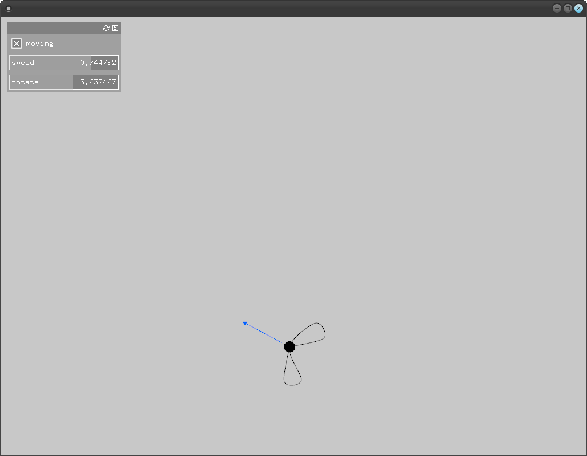

# About example

### Learning Objectives
This example demonstrates the most simple way to create a panel using the data you want to work with.

Pay special attention to the usage of `ofParameter`.

### Expected Behavior

When you open the app, you should see a screen with a fly. You can control its movements with the button and the sliders.

### Classes Used in This File

This example also uses:

	ofParameter
