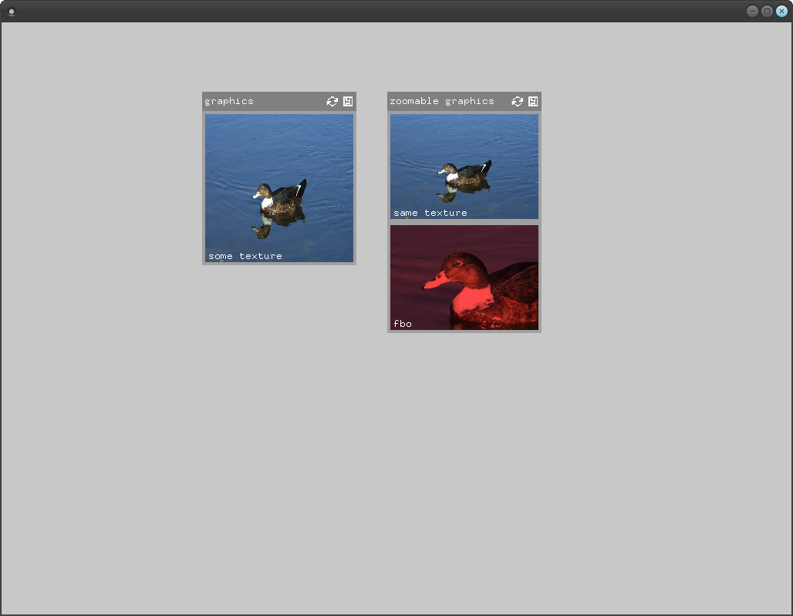

# exampleGraphics

### Learning Objectives

This example demonstrates how to show graphics within your graphical user interface.

In the code, you will learn how to..
* add an image to the panel
* add an fbo to the panel
* adjust the image size
* add the ability to zoom into the image

### Expected Behavior

When you run the application, you should see two panels. The left one shows the image of a duck with a fixed size. The right panel displays the same image, but its height is dependent on the image ratio. The second image on the right panel displays the texture of an fbo in which we draw the image in a specific color.

Use your scrolling wheel to zoom into the images of the right panel and click and drag your mouse to move the focus of the zooming image.

### Other classes used in this file

* `ofImage`
* `ofFbo`
