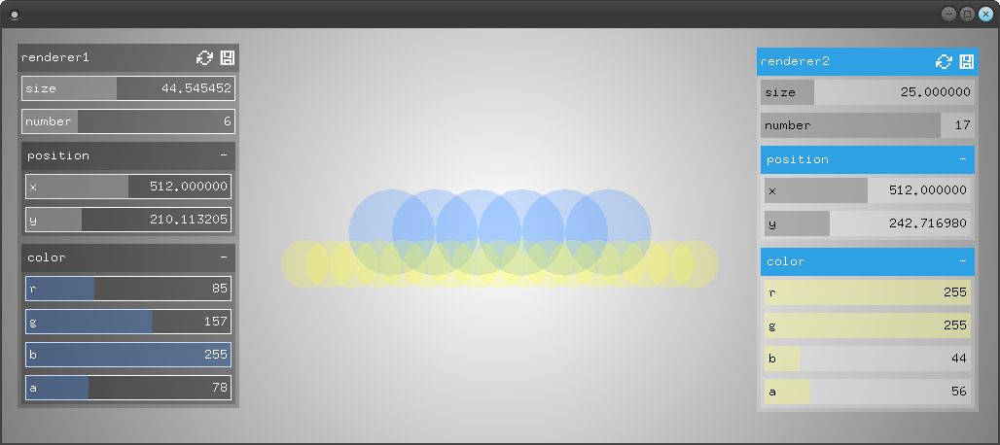

# exampleThemes

### Learning Objectives

This example demonstrates how to write your own theme for the GUI. It is written in JSON and placed in a separate file. It does not need to be recompiled after changing the theme.

Pay attention to the structure of the JSON theme file. You'll find more information about how to write the theme on [this page](https://github.com/frauzufall/ofxGuiExtended/#styling-items-by-type-via-theme).

### Expected Behavior

When starting the program you see two panels showing settings for a circle renderer. The rendered circles are displayed in the middle. You can control each set of circles with one panel.
The panels have different styles. The theme JSON file for the left panel is `bin/data/theme_default.json`. The right panel is styled by `bin/data/theme_light.json`.

### Other classes used in this file

- `ofParameter`
- `ofParameterGroup`
